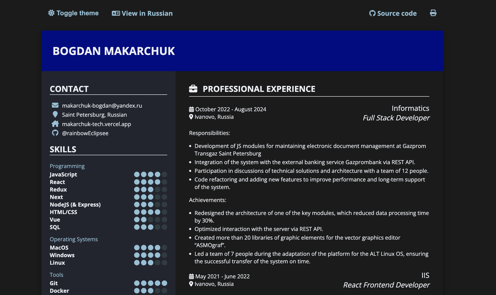

# CV - Bogdan Makarchuk




## Running Locally

You must install [Hugo](https://gohugo.io/) and then run

```
hugo server -D
```

Additionally, to install formatting dependencies, run

```
npm install
npm run format # run formatter
```

## Building to Production

To build for production with minification, run

```
hugo -D --gc --minify
```

## Printing to PDF

Sometimes it might be desirable to print to a page longer than A4,
as to avoid a page break.
A workaround is to print to PDF as an A2 and then use Ghostscript to
crop the resulting PDF.
